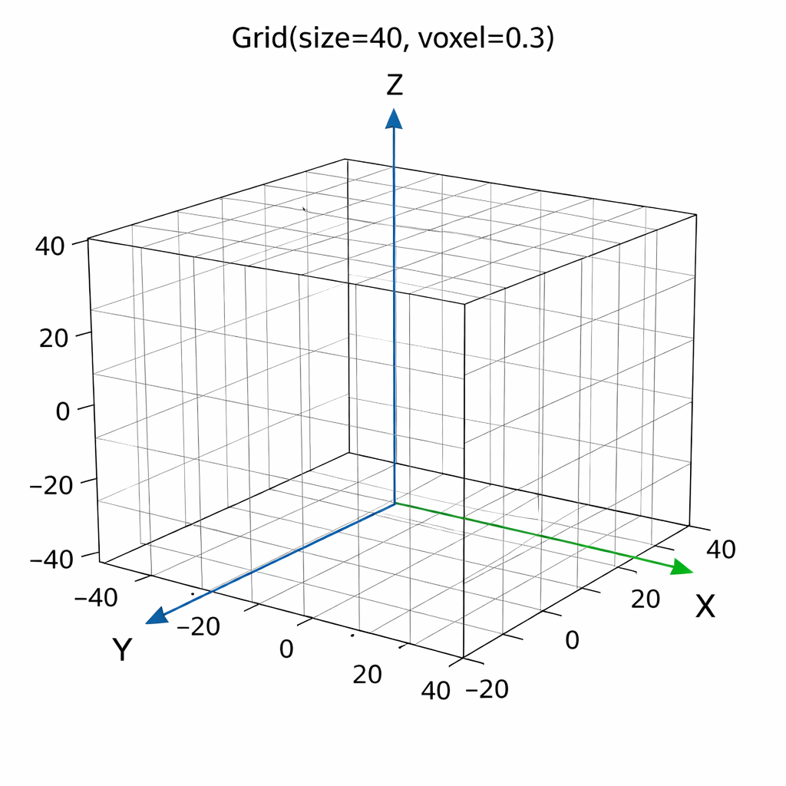
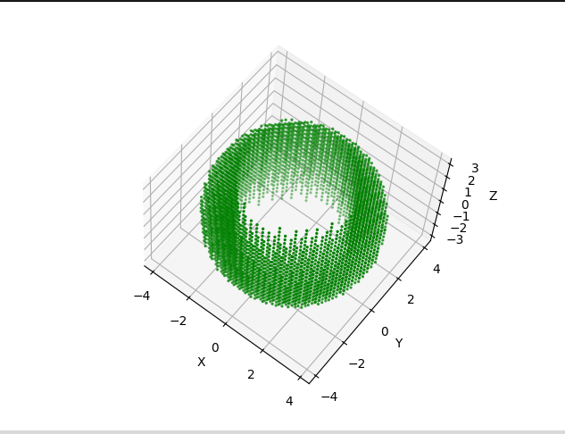
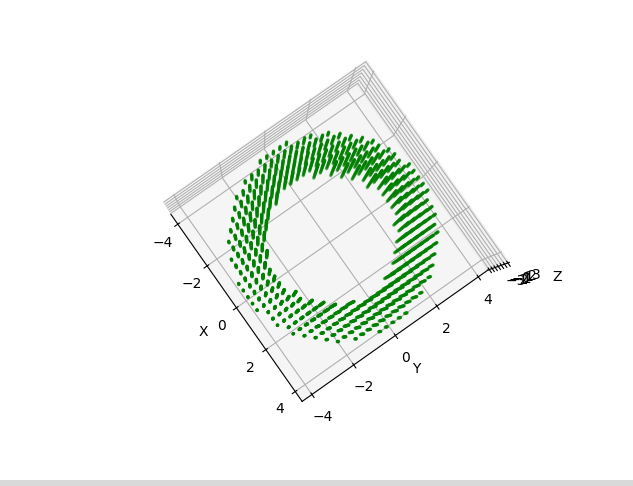

# Lexica
Transforming the future of engineering and thus the future of innovation

## Overview

The system is built in three main parts:
1. 🟢 Shapes → define distance  
2. 🔗 Operations → modify distance  
3. 🌐 Grid → evaluates distance everywhere

Every shape is defined by a single idea:

👉 "Given a point, how far am I from my surface?"

This is implemented using Signed Distance Functions (SDFs).

👉 Think:

Every shape knows how to measure distance from itself

Each shape is its own class:
- Sphere
- Cube
- Cylinder
- Cuboid

Each one overrides the same function:

distance(point)

Implementation: [`shapes.cpp`](./Private/shapes.cpp)

## 🌌 From a Point to a World

Every complex structure in Lexica starts from something extremely simple:

👉 a single point in 3D space

## 🌐 The Grid — “Turning space into structure”

The grid is how we turn space into something computable.

We define a 3D region using:
- Size → how far the space extends
- Voxel size → distance between points

For example :

When i write  Grid(40 , 0.3)   40->Size  0.3-> Voxel size 
Then a 3d Grid is created in space like a canvas

  

  <i>A 3d canvas in space</i>

size → controls the boundary (how far we go)

voxelSize → controls resolution (how fine we scan)

Now the distance function has been defines and the canvas is ready , what left is creating a distance feild in this canvas and get the surface we need

### What happens during sampling

At each generated point:

→ call distance(point)
→ result depends on current shape / operation

The grid is constant.

Only this changes:
distance(point)

And that alone creates completely different structures.

Everytime a shapes is called or an operation is applied the distance function in that child class is overridden

See: [`grid.cpp`](./Private/grid.cpp)

## 🔗 Operations — How Shapes Interact

Once we have shapes, the next step is interaction.

Not by drawing them…

👉 but by transforming how distance is computed.

### ⚙️ The Three Core Operations

Lexica supports three fundamental operations:

- Union  
- Intersection  
- Difference  

---

### ➕ Union

`distance = min(d1, d2);`

---

### 🔗 Intersection

`distance = max(d1, d2);`

---

### ✂️ Difference

`distance = max(d1, -d2);`

---

### 💡 Intuition

The grid does not change.  
The sampling does not change.  

Only this changes:

`distance(point)`

Each operation reshapes this function.

👉 Same evaluation, different behavior  
👉 Same space, different structure  

---

### ✨ Note

Until sampling begins:

- No geometry exists  
- No points are evaluated  
- No visualization happens  

👉 Only the distance function evolves.

---

### 🔗 Implementation

See: [`operations.cpp`](./Private/operations.cpp)

### ✨ Note

All of this happens before any sampling or visualization.

👉 Only the distance logic is being shaped.

## 🧪 Example — From Definition to Geometry

### Code

    #include "grid.h"

    int main() {
        Grid g(40, 0.3);

        Cylinder c(2.5, 10);
        Sphere s(4);

        Subtract sub(&s, &c);

        g.sample(sub);
        g.exportf("subtracted.obj");
    }

---

## 🌱 What we are really doing

We are not building geometry directly.

We define a system…  
and let it discover the shape.

---

## 🔍 Step by Step

- **Grid** defines the world  
  → a bounded 3D space with a chosen resolution  

- **Shapes** define behavior  
  → each shape knows how to compute distance  

- **Operation** defines interaction  
  → here, the cylinder is carved out of the sphere  

- **Sampling** triggers evaluation  
  → every point in space asks: *what is the distance here?*  

- **Export** captures the result  
  → the invisible becomes a mesh

  

  
  

  <i>Before Operation (Sphere + Cylinder) &nbsp;&nbsp;&nbsp;&nbsp; | &nbsp;&nbsp;&nbsp;&nbsp; After Subtraction Result</i>

---

## 💡 Intuition

Nothing exists… until we ask.

The grid moves through space, point by point,  
and at each step:

→ it queries the distance function  

That function has been shaped by:
- geometry (sphere, cylinder)  
- logic (subtraction)  

And from those answers…

👉 structure emerges

---

## ✨ The Core Idea

We never explicitly construct the surface.

We only define:

`distance(point)`

Everything else follows.

---

## 🔄 The Flow

Point → Distance → Shape → Operation → Sampling → Geometry

---

## 🎯 What this shows

- Simple rules can create complex structure  
- Geometry is not stored — it is computed  
- The same system can generate infinite variations  

---

## 🚀 Final Thought

Change the shape.  
Change the operation.  
Change the resolution.

👉 The system adapts.
